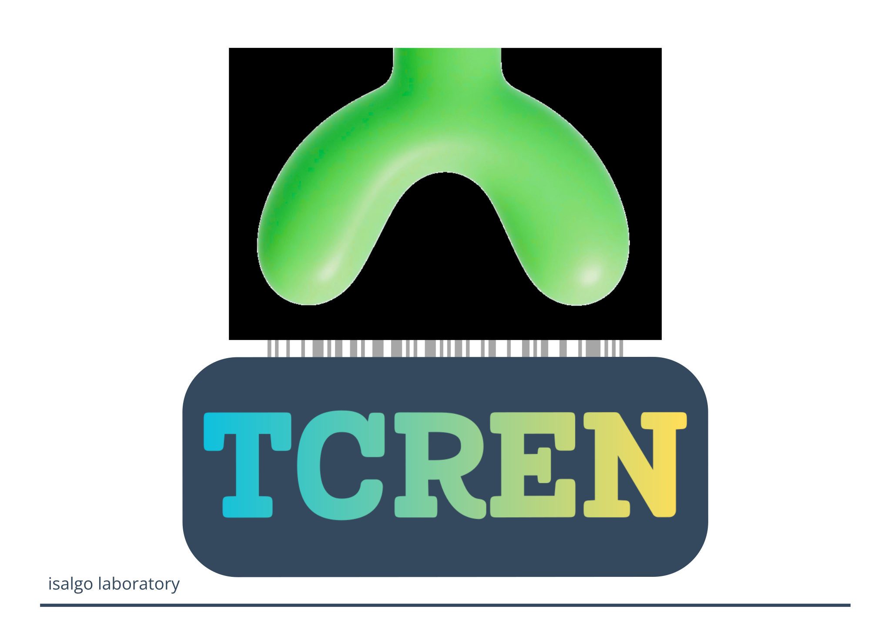
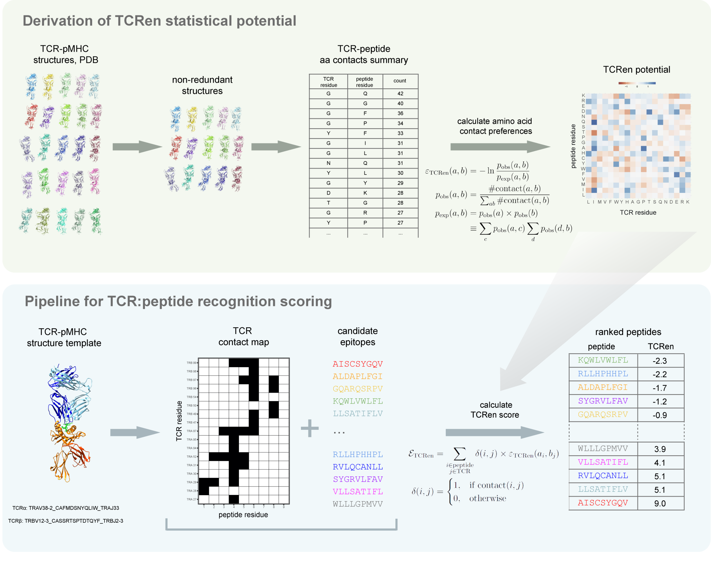

> The pipeline is free for acadimc and non-commercial use. Inquiries regarding commercial use can be e-mailed to the last author (PI) of [the study](https://www.nature.com/articles/s43588-024-00653-0) and dully ignored.



# The algorithm

This is a method for prediction of TCR recognition of unseen epitopes based on residue-level pairwise statistical potential scoring. While AI-guided prediction of TCR:pMHC structures is becoming routine now, and methods such as AlphaFold provide structure confidence that correlates with the probability of a complex coming from true binder, the following question still remains open: AlphaFold (or any other AI-based method) will always try to "please" the user and provide him with a "fancy" TCR:peptide:MHC structure, but is the binding physically possible and can this complex exist in nature in the first place?

TCRen method starts from a structure of the peptide-MHC complex with the TCR of interest—either experimentally derived or based on a homology model—then extracts a TCR-peptide contact map and estimates the TCR-peptide energy of interaction for all candidate  epitopes using TCRen potential, which we derived from statistical analysis of amino acid contact preferences in TCR:pMHC crystal structures.



## Python library (`tcren`)

A Python re-implementation of the TCRen pipeline lives under `src/tcren/`. It replaces
the legacy Java `mir` annotator with [`arda`](https://github.com/antigenomics/arda) for
TCR chain mapping and reproduces the original contact maps, potential and scores
numerically (validated against the committed CSV oracles to floating-point precision).

### Install

```fish
bash setup.sh              # creates the `tcren` conda env, installs arda + tcren
conda activate tcren
```

`setup.sh` expects the sibling `arda` checkout next to this repo (or set `ARDA_DIR`).

### Command line

```fish
# End-to-end scoring (drop-in replacement for run_TCRen.R)
tcren score -s example/input_structures -c example/candidate_epitopes.txt -o out.csv

# Native (TCR3D) database — versioned download + uses
tcren native bootstrap              # fetch TCR3D CIFs + annotation tables -> data/native
tcren native status --check-remote  # show local version; check if TCR3D updated it
tcren native derive-potential -o TCRen_native.csv   # re-derive TCRen from native structures
#   (a custom/previous TCR3D copy: pass --root DIR, or set TCREN_NATIVE_DIR)

# MHC allele/class/role mapping (build the reference once)
tcren build-mhc-ref                # downloads IMGT/HLA + mouse H-2 (cached, not committed)
tcren mhc -s example/input_structures -o mhc_calls.csv

# Canonical orientation — superpose TCR-pMHC into one MHC frame, rename chains A-E
tcren orient -s example/input_structures -o oriented/ --metadata orient.csv
#   z (PC1) = MHC->TCR, y (PC2) = peptide, x (PC3); chains: A=Va B=Vb C=peptide D=MHCa E=MHCb/b2m

# Other subcommands
tcren annotate -s example/input_structures -o markup.csv
tcren contacts -s example/input_structures -o contacts.csv --interface tcr_peptide
tcren derive-potential -i data/contact_maps_PDB.csv --summary data/summary_PDB_structures.csv --nonred -o TCRen_potential.csv
tcren info
```

### Library

```python
from tcren import parse_structure, ContactMap, score_peptides
from tcren.annotation import classify_chains
from tcren.potential import tcren

s = parse_structure("example/input_structures/6uk4_TCRpMHCmodels_polyV.pdb")
classify_chains(s, organism="human")          # TRA/TRB via arda, peptide, MHC
cm = ContactMap.from_structure(s)              # 5 Å contacts + interface partitioning
ranked = score_peptides(cm, ["KQWLVWLFL", "RLLHPHHPL"], tcren())
```

### Canonical orientation & flexible contacts

```python
from tcren.mhc import annotate_mhc
from tcren.orient import canonicalize_structure, align_to_canonical
from tcren.contacts import multi_contacts, ContactDefinition

annotate_mhc(s)
oriented, info = canonicalize_structure(s)     # PCA frame: z=MHC->TCR, y=peptide, chains A-E
#   align a NEW structure onto the dataset frame: align_to_canonical(new_structure)

# three nested contact layers: d1 heavy-atom (5 Å), d2 Cβ (8 Å, Cα for Gly), d3 Cα (12 Å)
layers = multi_contacts(s, ContactDefinition(d1=5, d2=8, d3=12))
```

Structures come from the Hugging Face dataset
[`isalgo/tcren_structures`](https://huggingface.co/datasets/isalgo/tcren_structures):
`Native2022` (the 2022 paper set, oracle) and `Native2026` (the comprehensive 2026 TCR:pMHC
set), both in the canonical orientation.

### 2D complementarity maps & C-gene-aware import

```python
from tcren import import_structure                 # trims the TCR C-gene by default
from tcren.annotation import classify_chains
from tcren.mhc import annotate_mhc
from tcren.project2d import project_structure, residue_markup_table, contacts_table
from tcren.viz import render_complementarity_map, view_pocket_cdr

s = import_structure("complex.cif")                # keep_c_gene=True for MD / FlexPepDock
classify_chains(s, organism="human"); annotate_mhc(s)
proj = project_structure(s)                        # canonical groove plane (TCR on top)
markup = residue_markup_table(s, proj)             # tidy polars: chain/region/aa/x,y,z
contacts = contacts_table(s, threshold=5.0)        # TCRen-compatible, classified by bond type
svg = render_complementarity_map(markup, contacts=contacts)   # metadata-rich SVG
view_pocket_cdr(s).show()                          # interactive 3D pocket + CDR overlay (py3Dmol)
```

See the tutorial notebooks under `docs/notebooks/` for full examples.

Run the tests with `pytest tests/` (set `RUN_BENCHMARK=1` for the full-dataset sweeps).
Project status & open tasks: [STATUS.md](STATUS.md); achieved accuracy & performance:
[BENCHMARKS.md](BENCHMARKS.md).

---

# Legacy R pipeline

The original R + Java pipeline is preserved below and remains the reference
implementation; the Python library above reproduces its results.

## Dependencies
R with packages data.table, tidyverse, optparse, stringr, magrittr (tested on: R v4.0.5 with data.table v1.14.0, 
tidyverse v.1.3.1, optparse v1.7.3, stringr v1.4.0, magrittr v2.0.3; R v4.2.0 with data.data.table v1.13.0, 
tidyverse v.1.3.0, optparse v1.7.3, stringr v1.4.0, magrittr v1.5; we expect other package
versions should also be compatible with the script)

Java (tested on openjdk 11.0.16)

## Repository content
* Script to run TCRen pipeline on new target TCRs and candidate epitopes. 
This script is provided in 2 versions: 1) as Rmarkdown file ``TCRen_pipeline/run_TCRen.Rmd`` which 
can be run in Rstudio (the first chunk should contain paths to input files); 
2) as R script ``TCRen_pipeline/run_TCRen.R`` which can be run from a command line 
(with arguments indicating paths to input files; for details see Tutorial below)

* Example files for input and output (folder ``example``)

* Scripts and data to reproduce the benchmarking of TCRen performance and other analysis performed 
in the corresponding paper (scripts in the folder ``code_paper``, data in the folder ``data``)

* All cleaned-up TCR-peptide-MHC structures from PDB (folder ``data/PDB_structures``) with meta-data 
(``data/summary_PDB_structures.csv``) and the file with all extracted TCR-peptide residue contacts (``data/contact_maps_PDB.csv``)

* Values of TCRen potential (``TCRen_potential.csv``)

## TCRen input 
1. A structure of TCR-peptide-MHC complex (either experimentally derived or a homology model). Several structures may be submitted at once. Structure(s) should be placed in a single folder.
* Example: ``example/input_structures``

2. A list of candidate epitopes.
* Example: ``example/candidate_epitopes.txt``

## TCRen output
A table with 4 columns: complex.id (corresponding to the name of an input structure), peptide (corresponding to the name of a candidate peptide), potential (“TCRen” if the default ```TCRen_potential.csv``` file is used) and score (TCRen estimate of energy of peptide-TCR interaction).
* Example: ``example/output_TCRen/candidate_epitopes_TCRen.csv``

## Tutorial
1. Clone the github repository for TCRen:

```
$ git clone https://github.com/antigenomics/tcren-ms.git
```

2. Prepare a structure (or several structures) of TCR-peptide-MHC complex. Format: “.pdb”.

* All structures for which predictions will be done should be placed in a single directory (e.g. ``example/input_structures``)

* If for the TCR of interest a crystal structure of the ternary complex (TCR-peptide-MHC) with some peptide is available 
(i.g. for the task of prediction of cross-reactivity of a well-known TCR), 
it can be downloaded directly from [PDB](https://www.rcsb.org/) and used as input. 
For the task of predictions for unseen TCRs, homology model(s) should be used as input, 
e.g. obtained using TCRpMHCmodels tool which is implemented both as a 
[webserver](https://services.healthtech.dtu.dk/service.php?TCRpMHCmodels-1.0) and a 
[stand-alone software](https://services.healthtech.dtu.dk/cgi-bin/sw_request). 
Detailed instructions for TCRpMHCmodels tool use can be found on the webserver site and in README of software download.
The modeling usually requires a few minutes for a single TCR-peptide-MHC complex either in the web-server or in a single CPU. 

3. Prepare a list of candidate epitopes (e.g. mutated peptides predicted as binders to host MHC for the task of prediction of neoepitope recognition). Format: “.txt” file with each candidate epitope in a separate line, with a header “peptide”. Note that only peptides with the same length as in the input structures would be considered for predictions.
* Example in ``example/candidate_epitopes.csv``

4. Run TCRen pipeline (typical runtime is within minutes for a standard laptop). 

* The pipeline should be run the directory containing all the files necessary for TCRen launching: ``run_TCRen.R``, 
``TCRen_potential.csv`` and ``mir-1.0-SNAPSHOT.jar`` (java script for annotation and extraction of contacts in TCR-peptide-MHC structures)

* Detailed comments on all stages of TCRen pipeline can be found in Rmarkdown file ``run_TCRen.Rmd`` which is identical 
in terms of the main code to ```run_TCRen.R```

```
$ cd TCRen_pipeline
$ Rscript --vanilla run_TCRen.R -s ../example/input_structures/ -c ../example/candidate_epitopes.txt -p TCRen_potential.csv -o ../example/output_TCRen/ -m 1G
```

* Arguments of run_TCRen.R script:

| option                                         | Description                                      |    
|------------------------------------------------|--------------------------------------------------|
| -s, --structures                               | directory with input structures                  |
| -c, --candidates                               | file with candidate epitopes                     |
| -p, --potential                                | file with energy potential (TCRen)               |
| -o, --out                                      | directory for TCRen output                       |
| -m, --memory                                   | memory allocation                                |

5. The output of TCRen can be found in the file ``candidate_epitopes_TCRen.csv`` in the folder which was set by -o flag. The content of the output file is described above in the section “TCRen output”

## Additional calculation

See ``tcren_am/`` for derivation of alignment scoring matrices from TCRen and extended TCRen that includes Cys (``C``) and gap (``-``).

## Cite as

Karnaukhov, V.K., Shcherbinin, D.S., Chugunov, A.O. et al. Structure-based prediction of T cell receptor recognition of unseen epitopes using TCRen. Nat Comput Sci 4, 510–521 (2024). https://doi.org/10.1038/s43588-024-00653-0
