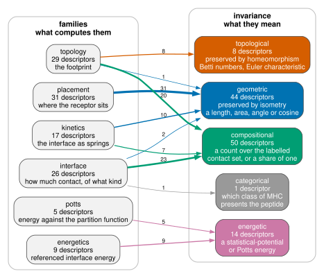

Interface feature reference
===========================

``tcren features`` turns a set of TCR–pMHC structures into one flat table — **one row per
structure**, one interface descriptor per column — and ``tcren recognize`` turns that table into
scores. Features and scores are two commands because they are two jobs: the feature pass reads
structures and is the expensive half, the scoring pass is arithmetic over a table and can be
repeated for nothing.

.. code-block:: console

   # every descriptor, in the four families (add kinetics with --all):
   tcren features -s structures/ -i placement,interface,topology,energetics -o feats.tsv
   # one family only -- and only that family is computed:
   tcren features -s structures/ -i topology -o shape.tsv
   # scores from the table, without re-reading a single structure:
   tcren recognize --features feats.tsv -o scores.tsv

``tcren recognize -s structures/`` reads the structures itself and writes the descriptor table with
``p_real`` (``--full`` for the CDR3-frame layer, ``--mechanics`` for the kinetics terms). ``Q`` and
``P_native`` come from ``--features``, which is the two-command route above.

Output is **TSV**. The first column ``complex.id`` is the structure-file stem (the SHA-256 ``TCR_hash``
for the modelled sets), which is the join key to labels and AlphaFold confidences. ``--features-only``
skips the models. Degenerate or undefined terms are ``NaN``. Every
feature is also available programmatically from :func:`tcren.recognition.recognition_features` (pass
``full=True``); the column-name tuples are :data:`tcren.recognition.RECOGNITION_FEATURES`,
:data:`~tcren.recognition.CDR3_FRAME_FEATURES` and :data:`~tcren.recognition.FULL_FEATURES`.
:data:`tcren.recognition.DESCRIPTORS` gives every column's family and whether the receptor enters its
definition; :func:`tcren.recognition.descriptors` selects on both (see :ref:`descriptor-families`).

Metadata that ships with a structure set
----------------------------------------

Descriptors are computed *from* coordinates; the binding label, the epitope and allele, and the
generator's own confidence (``iptm``, ``plddt``, ``ranking_confidence``) are not in the coordinates
and travel beside them, in a ``metadata.tsv`` keyed by ``id`` = the structure stem — the same value
``tcren features`` writes into ``complex.id``. ``tcren features`` joins it automatically when one is
present (``--no-metadata`` to skip), and :func:`tcren.metadata.join_metadata` does the same in
Python::

    from tcren.metadata import join_metadata
    table = join_metadata(table, "vdjdb_free_pool")     # no-op if the set ships none

The key must be the **stem, not a bare receptor hash**. A receptor that appears once as a positive
and once as a mispaired negative shares its hash across both rows, so a hash-keyed table is not
unique and the join silently drops rows: the shipped ``vdjdb_binder_benchmark`` table was keyed that
way and matched 523 of 1,089 structures, losing all 566 negatives.
:func:`tcren.metadata.read_metadata` raises on a duplicate ``id`` for that reason.

Conventions used below: **tp** = TCR↔peptide interface, **tm** = TCR↔MHC, **pm** = peptide↔MHC.
``F_*`` is a raw interface energy Φ and ``dF_*`` its poly-alanine reference delta ΔΦ — every energy
column is named ``F``, because the potential is fixed by the interface rather than chosen per column:
TCR↔peptide uses the **TCRen** potential, TCR↔MHC and peptide↔MHC the **Miyazawa–Jernigan (MJ)**
potential. Energies are in dimensionless statistical-potential units (more negative = more
favourable); they are log-odds ratios of contact frequencies and are *not* in kT.

.. note::

   Both commands annotate the MHC chains, which needs the MHC allele reference. It is built from
   IMGT on demand rather than bundled in the wheel, so run ``tcren build-mhc-ref`` once after a
   ``pip install`` (see :ref:`mhc-reference`).

Options
-------

``tcren features``:

.. list-table::
   :header-rows: 1
   :widths: 30 22 48

   * - option
     - default
     - what it does
   * - ``-s``, ``--structures``
     - *required*
     - structure file, directory, ``.tar.gz``, quoted glob, ``.txt`` manifest, comma-separated
       list, or a repeated flag
   * - ``-o``, ``--out``
     - ``features.tsv``
     - the per-structure descriptor table
   * - ``-i``, ``--include``
     - ``placement,interface,topology,energetics``
     - comma-separated families; only what you ask for is computed
   * - ``--all``
     - off
     - every family, ``kinetics`` included
   * - ``--radii``
     - ``7,8``
     - Cα thresholds (Å) for the footprint flag complex, so the ``topology`` family emits
       ``fp_*_r7`` and ``fp_*_r8``
   * - ``--organism``
     - ``human``
     - organism passed to the TCR annotator
   * - ``-t``, ``--threads``
     - ``1``
     - worker processes for featurisation (``0`` = all cores); annotation stays one batched call
   * - ``--autodetect-species`` / ``--no-autodetect-species``
     - on
     - also search mouse, to catch a mis-declared organism; ``--no-`` halves the annotation cost

``tcren recognize`` takes ``-s``, ``-o`` (default ``recognize.tsv``), ``--organism``, ``-t`` and
``--autodetect-species`` with the same meanings, plus:

.. list-table::
   :header-rows: 1
   :widths: 30 22 48

   * - option
     - default
     - what it does
   * - ``--features``
     - unset
     - score a table already written by ``tcren features``, instead of re-reading the structures
   * - ``--features-only``
     - off
     - emit the descriptors and skip the models
   * - ``--full``
     - off
     - add the 18 CDR3-frame descriptors and the intra-peptide terms ``F_pep_int``/``n_pep_int``
   * - ``--mechanics``
     - off
     - append the ``kinetics`` terms in the same pass, with no second annotation
   * - ``--scores``
     - off
     - legacy: the fitted ``p_bind`` / ``p_forced`` and their fit-free companions ``q_bind`` /
       ``s_strain``, kept for v1 reproduction; implies ``--full``

``--features`` and ``-s`` are the two ways in. With ``--features`` the output is the score table
alone — ``complex.id``, ``Q``, ``G``, ``T``, ``E``, ``P_native``, and ``S_free`` with its calibrated
``p_binder``; with ``-s`` it is the descriptor table plus ``p_real``.

.. _reliability-columns:

Columns the reliability score reads
------------------------------------

:func:`tcren.reliability.s_free` is the recommended single-structure score and reads three blocks
off this table. Two of them come from ``tcren features`` directly, and the third has to be joined:

.. list-table::
   :header-rows: 1
   :widths: 18 30 52

   * - block
     - source
     - what to request
   * - ``Q``, geometry
     - ``tcren features``
     - ``-i placement,interface`` — ``burial``, ``n_pep_contacted``, ``chain_balance``, ``n_hbond``
   * - ``T``, topology
     - ``tcren features``
     - ``-i topology`` — ``D2_pep24``, ``fp_b0_frac_r7``, ``H_cell``, ``L_canon``, ``ab_imb``
   * - ``neg_energy``, the energy
     - ``tcren potts score``
     - join on ``pdb.id``; it is :math:`-E(\sigma_{\mathrm{obs}})`, the interface energy read
       against the partition function

``tcren diagnose`` reads the same blocks plus ``n_contacts``, the Potts count of available pairs
that engaged, so its full input is ``-i placement,interface,topology,potts``. The column belongs to
the ``potts`` family and to no other: through 2.19.0 the footprint wrote its CDR-loop tally under
the same name — a different quantity on the same structure, 66 against 29 on 1ao7 — and since the
topology pass runs before the Potts one, the emitted column meant whichever family the caller
happened to ask for. That tally is ``n_loop_contacts`` now, and a table that still carries the old
name is **refused** by :func:`~tcren.reliability.correct_confidence` rather than standardized
against the wrong population. Without ``n_contacts`` the contact term drops out and is reported as
``n/a`` rather than imputed.

So ``-i placement,interface,topology,energetics`` is what ``tcren assess`` requires (see
:doc:`reliability`), and
without the joined ``neg_energy`` column ``assess`` emits the two-block form and says so in its
report rather than imputing the missing block.

.. _descriptor-families:

Families, and which descriptors involve the receptor
----------------------------------------------------

Every emitted column is catalogued in :data:`tcren.recognition.DESCRIPTORS` as
``name -> (family, involves_tcr)``, and selected with :func:`tcren.recognition.descriptors` or with
``tcren features -i``. The families split by **what each quantity is invariant under**, which is
also the axis along which they carry independent evidence:

.. list-table::
   :header-rows: 1
   :widths: 14 46 40

   * - family
     - what it is
     - examples
   * - ``placement``
     - where the receptor sits in the groove frame. **Frame-dependent.**
     - ``crossing_signed``, ``pitch``, ``dock_d``, ``dock_torsion``, ``height``, ``shift_u/w``,
       ``offset``, the 18 CDR3 frame terms
   * - ``interface``
     - how much contact there is and of what chemical kind. SE(3)-invariant.
     - ``burial``, ``extent``, ``n_contacts_tp/tm``, ``n_hbond``, ``ct_*``, ``n_clashes``,
       ``n_loop_contacts``
   * - ``topology``
     - the *shape* of the contact set, free of its size. SE(3)-invariant, so these need no
       canonical orientation.
     - ``H_cell``, ``D2_cell``, ``D2_pep24``, ``fp_b0_*``, ``fp_b1_*``, ``h0_pers_ent``,
       ``L_canon``, ``ab_imb``
   * - ``energetics``
     - statistical-potential interface energies and their poly-alanine references.
     - ``F_tcr_pep``, ``F_tcr_mhc``, ``F_cdr12/3a/3b``, ``dF_tcr_pep``
   * - ``potts``
     - the same contact energy read against the **partition function** instead of a poly-alanine
       interface, under the coupled contact-map model (:mod:`tcren.potts`). The decomposition is
       exact: ``neg_energy = log_z + log_lik``, capacity plus typicality.
     - ``neg_energy``, ``log_z``, ``log_lik``, ``psi``, ``n_contacts``
   * - ``kinetics``
     - the interface as a network of breakable springs. Off unless asked for.
     - ``K_tens``, ``aniso``, ``rupture_force``, ``rupture_work``, ``couple_*``

Which reference to use is decided by the task, not by preference. ``energetics`` subtracts a
poly-alanine interface *in the same pose*, which is right when every candidate carries its own pose
— ranking peptides for a fixed receptor. ``potts`` subtracts every contact map the geometry admits,
which is right when the pose is shared and what varies is capacity — ranking receptors for a fixed
epitope. Each is at or near chance on the other's task.

Two views of the same descriptors
---------------------------------

The six **families** are what computes the descriptors: one pass of one command each, and
``tcren features -i <family>`` is how you ask for one. The **invariance classes** are what they
mean, and the two do not line up.

   Every descriptor, by what computes it and by what it is invariant under. Edge labels are
   descriptor counts and edge width tracks them.

Read the thick edges. ``placement`` is geometric throughout -- 31 of 31 -- and it is the only
family that describes the **docking** in the sense of a quantity preserved by distance-preserving
transformations. The ``topology`` family is **mostly compositional**: 20 of its 29 columns are
diversity or coverage measures over labelled cells and positions, and only 8 are invariants of the
**interface surface** under continuous deformation. ``interface`` contributes 23 counts and two
continuous quantities.

That matters when a block is built from a family rather than from a class. ``Q`` is named for
interface geometry and carries one continuous quantity of four -- ``burial``, an area -- with no
angle, distance or height in it; ``T`` is named for shape and carries one topological invariant of
five. Seven of the nine terms across both blocks are compositional, which is why two blocks with
different names read the same evidence.

:data:`tcren.recognition.descriptors` filters on either axis, and they compose::

    descriptors("topology", invariance="topological")   # the interface surface, 8 columns
    descriptors(invariance="geometric", tcr_only=True)  # the docking

.. seealso:: :doc:`descriptor_table` lists all 117 with their units and definitions.

The alanine scan, on both sides
-------------------------------

``dF_tcr_pep`` and ``dF_pep_mhc`` are *aggregate* references: the whole peptide replaced by
poly-alanine at once. To see which residue earns the energy, scan one at a time.

:func:`tcren.ddg.alanine_scan` walks the **peptide** and :func:`tcren.ddg.tcr_alanine_scan` the
**receptor's contacted CDR residues**. Both truncate one residue to alanine **in 3D** through
:func:`tcren.refine.substitute.substitute_residues`, recompute the contact map and rescore, so a
side chain that was the only thing bridging to its partner loses those contacts. Alanine is the
target this needs no rotamer for: its heavy atoms are exactly backbone plus Cβ, so truncating at
Cβ *is* the alanine.

.. code-block:: console

   $ tcren ddg -s complex.pdb --native LLFGYPVYV --alanine-scan --side both -o ala.csv

``--side`` takes ``peptide`` (default), ``tcr`` or ``both``; ``--virtual`` takes the fast path that
re-indexes the mutant on the native map with no atoms moved, and is peptide-side only, because
truncating a receptor side chain without moving atoms would leave every contact it made in place.

Output is long — one row per scanned residue, with ``side``, ``pos``, ``wt_aa`` and ``ddG``, plus
``chain.id``, ``chain.type``, ``region.type`` and ``pos_index`` on the receptor rows. ``ddG`` is
``E(native) - E(Ala@residue)`` throughout, so a **positive** value marks a residue that was earning
its place.

:func:`tcren.ddg.tcr_alanine_reference` folds a receptor scan into four per-structure numbers —
``dPhi_ala_cdr12``, ``dPhi_ala_cdr3a``, ``dPhi_ala_cdr3b`` and their total ``dPhi_ala_tcr``. Each is
the **sum of the per-residue** ΔΔGs of that loop, not the energy of mutating the whole loop in one
pass; those differ once atoms move, because truncating every side chain at once loses contacts each
residue alone retains.

.. warning::

   Before 2.25.0 the scan's structural path threaded the whole peptide through
   :func:`~tcren.refine.substitute.substitute_peptide`, which truncates **every** residue to
   backbone plus Cβ. Each position was therefore read against a poly-stub baseline rather than the
   native — on 1ao7 the native sequence threaded back through it keeps 14 of 29 TCR:peptide
   contacts — and the resulting offset appeared at every position, including positions with no
   contacts at all. ``substitute_peptide`` remains correct for the poly-alanine *reference*, where
   every residue genuinely is mutated.

``placement`` and ``interface`` were a single ``geometry`` family until 2026-08-24, and
``energetics`` was ``physics``. Both retired names still resolve in
:func:`~tcren.recognition.descriptors`, so ``descriptors("geometry")`` returns the pooled
``placement`` + ``interface`` set.

The three **channels** ``P_native`` combines are ``geometry``, ``topology`` and ``energetics``
(:data:`tcren.cohort.P_NATIVE_CHANNELS`). A channel is not a family:
:data:`~tcren.cohort.P_NATIVE_POOL` maps each channel onto the families it draws on, and
``geometry`` is the pooled pair above, fitted as one network because ``placement`` and
``interface`` are the most dependent pair measured. The ``energetics`` **channel** draws on the
``potts`` **family**, not on the family of the same name: since 2.17.0 it reads ``neg_energy``,
``log_z`` and ``log_lik`` rather than ``F_tcr_pep``, because the receptor task is where it is used. ``kinetics`` is a descriptor family only — it
measures unbinding rather than nativeness, so it enters no channel and is not computed unless
asked for.

A further group, ``score``, holds the composites built *from* the descriptors above — ``p_real``,
``q_bind``, ``s_strain``. These are **outputs** and must never be fed back in as inputs, so
:func:`~tcren.recognition.descriptors` omits them unless ``with_scores=True``.

``involves_tcr`` is ``False`` for five columns — ``F_pep_mhc``, ``dF_pep_mhc``, ``mhc_class_bin``,
``F_pep_int`` and ``n_pep_int`` — each computed from the peptide and MHC alone. Two structures of the same epitope
on the same allele share their values whatever the receptor, so such a column carries **cohort
identity** rather than interface physics, and a model given one can reach a cohort-level label
without learning anything about recognition. Any analysis whose question is about receptors should
select ``tcr_only=True``::

    from tcren.recognition import descriptors

    descriptors("energetics", tcr_only=True)
    # ('F_tcr_pep', 'F_tcr_mhc', 'F_cdr12', 'F_cdr3a', 'F_cdr3b', 'dF_tcr_pep')

Core recognition descriptors (34)
---------------------------------

The base feature set the shipped real-vs-shuffled recognizers consume
(:data:`tcren.recognition.RECOGNITION_FEATURES`), emitted by ``tcren recognize`` with no extra flags.

Coverage & burial
~~~~~~~~~~~~~~~~~~

.. list-table::
   :header-rows: 1
   :widths: 20 16 44 20

   * - Column
     - Unit
     - Description
     - Source
   * - ``extent``
     - count
     - Distinct TCR interface residues contacting the pMHC (interface size).
     - contact map
   * - ``chain_balance``
     - ratio [0, 0.5]
     - ``min(a, b) / (a + b)`` over TCR:peptide contacts by TCR chain (TRA=a, TRB=b); 0.5 = both
       chains engage equally, 0 = one chain only (a degenerate/forced pose signature).
     - contact map
   * - ``n_contacts_tp``
     - count
     - Number of TCR↔peptide residue–residue contacts.
     - contact map
   * - ``n_pep_contacted``
     - count
     - Distinct peptide residues contacted by the TCR.
     - contact map
   * - ``n_contacts_tm``
     - count
     - Number of TCR↔MHC residue–residue contacts.
     - contact map
   * - ``burial``
     - Ų
     - Interface ΔSASA = SASA(TCR) + SASA(pMHC) − SASA(complex), biopython Shrake–Rupley.
     - biopython SASA

Docking geometry
~~~~~~~~~~~~~~~~~

.. list-table::
   :header-rows: 1
   :widths: 20 16 44 20

   * - Column
     - Unit
     - Description
     - Source
   * - ``pitch``
     - degrees
     - Incident (tilt) angle of the TCR over the pMHC groove — a clean structural angle.
     - :func:`tcren.orient.docking_angles`
   * - ``crossing``
     - degrees
     - TCR crossing (scanning) angle relative to the groove long axis.
     - :func:`tcren.orient.docking_angles`
   * - ``dock_d``
     - Å
     - MHC-stub → TCR-stub rigid-body separation (native TCRdock geometry).
     - ``orient.tcrdock_geometry``
   * - ``dock_torsion``
     - radians
     - Rigid-body dihedral of the TCR about the MHC stub (circular; wraps at ±π).
     - ``orient.tcrdock_geometry``
   * - ``dock_tcr_uy``, ``dock_tcr_uz``
     - unit
     - y/z components of the TCR stub unit vector in the MHC frame.
     - ``orient.tcrdock_geometry``
   * - ``dock_mhc_uy``, ``dock_mhc_uz``
     - unit
     - y/z components of the MHC stub unit vector.
     - ``orient.tcrdock_geometry``

Interface energies
~~~~~~~~~~~~~~~~~~~

.. list-table::
   :header-rows: 1
   :widths: 20 16 44 20

   * - Column
     - Unit
     - Description
     - Source
   * - ``F_tcr_pep``
     - TCRen
     - Raw TCR↔peptide interface energy (whole interface, all TCR regions).
     - :mod:`tcren.pipeline` energy
   * - ``F_tcr_mhc``
     - MJ
     - Raw TCR↔MHC interface energy.
     - :mod:`tcren.pipeline` energy
   * - ``F_pep_mhc``
     - MJ
     - Raw peptide↔MHC interface energy.
     - :mod:`tcren.pipeline` energy
   * - ``F_cdr12``
     - TCRen
     - TCR↔peptide energy over the CDR1+CDR2 loops only.
     - :mod:`tcren.pipeline` energy
   * - ``F_cdr3a``
     - TCRen
     - TCR↔peptide energy over the CDR3α loop only.
     - :mod:`tcren.pipeline` energy
   * - ``F_cdr3b``
     - TCRen
     - TCR↔peptide energy over the CDR3β loop only.
     - :mod:`tcren.pipeline` energy
   * - ``dF_tcr_pep``
     - TCRen
     - Poly-alanine reference delta of the TCR↔peptide energy (geometry-normalized ΔΦ).
     - :func:`tcren.ddg.reference_delta`
   * - ``dF_pep_mhc``
     - MJ
     - Poly-alanine reference delta of the peptide↔MHC energy.
     - :func:`tcren.ddg.reference_delta`

Contact-type tallies
~~~~~~~~~~~~~~~~~~~~~~

Per-interface counts of contacts of each chemical type (``tp`` = TCR↔peptide, ``tm`` = TCR↔MHC),
from :func:`tcren.contact_types.contact_type_counts`.

.. list-table::
   :header-rows: 1
   :widths: 34 16 50

   * - Columns
     - Unit
     - Description
   * - ``ct_tp_salt_bridge``, ``ct_tm_salt_bridge``
     - count
     - Salt-bridge contacts on each interface.
   * - ``ct_tm_hydrogen_bond``
     - count
     - Hydrogen-bond contacts on the TCR↔MHC interface. (The TCR↔peptide count is emitted once,
       as ``n_hbond`` — the name Eq. Q uses.)
   * - ``ct_tp_aromatic``, ``ct_tm_aromatic``
     - count
     - Aromatic (π-stacking) contacts on each interface.
   * - ``ct_tp_hydrophobic``, ``ct_tm_hydrophobic``
     - count
     - Hydrophobic contacts on each interface.
   * - ``ct_tp_other``, ``ct_tm_other``
     - count
     - Remaining contacts on each interface.
   * - ``n_hbond``
     - count
     - Hydrogen-bond contacts on the TCR↔peptide interface; a term of Eq. Q.

MHC class
~~~~~~~~~

.. list-table::
   :header-rows: 1
   :widths: 20 16 64

   * - Column
     - Unit
     - Description
   * - ``mhc_class_bin``
     - 0/1
     - 1 if any MHC chain is MHC class II, else 0 (from MHC annotation).

Interface quality — clashes & contact stability
-----------------------------------------------

Coordinate-only reads of forced-pose quality, always emitted by ``recognize`` (not part of the 34
model features): a steric-clash burden (:mod:`tcren.clashes`) and TCR:peptide contact fragility
(:mod:`tcren.stability`). Both are computed natively (``_geom``).

.. list-table::
   :header-rows: 1
   :widths: 20 16 44 20

   * - Column
     - Unit
     - Description
     - Source
   * - ``n_clashes``
     - count
     - Peptide↔partner heavy-atom pairs overlapping by more than 0.4 Å (Bondi vdW radii); the
       signature of a non-physical / wrong-register pose.
     - clashes
   * - ``clash_score``
     - Å
     - Summed overlap of all clashing pairs — a total steric-burden measure.
     - clashes
   * - ``exp_lost``
     - count
     - Expected TCR:peptide contacts lost under a 1 Å isotropic shift, ``Σ clip((1 − margin)/2, 0, 1)``
       over contacts (``margin = 5 − dmin``).
     - stability
   * - ``mean_margin``
     - Å
     - Mean contact margin ``5 − dmin`` over TCR:peptide contacts; larger = contacts sit deeper below
       the 5 Å cutoff.
     - stability
   * - ``frac_robust``
     - ratio [0, 1]
     - Fraction of TCR:peptide contacts with margin ≥ 1 Å (robust to a 1 Å shift).
     - stability

CDR3-frame descriptors (18) — ``--full``
----------------------------------------

The FramePose layer the whole-TCR features miss: each CDR3 loop projected onto the **pMHC groove
frame** (basis ``u, w, n``; origin = peptide Cα centroid). Computed by
:func:`tcren.recognition.recognition_features` with ``full=True``
(:data:`~tcren.recognition.CDR3_FRAME_FEATURES`). The ``cdr3b_*`` strain terms are the load-bearing
signal for forced-pose / hallucination detection. Columns are prefixed by loop (``cdr3a_`` for TRA,
``cdr3b_`` for TRB):

.. list-table::
   :header-rows: 1
   :widths: 20 16 64

   * - Suffix
     - Unit
     - Description
   * - ``reach``
     - Å
     - Distance from loop Cα centroid to the groove origin (how far the loop reaches out).
   * - ``ou``, ``ow``, ``on``
     - unit
     - Projection of the (centroid − origin) direction onto ``u``, ``w``, ``n`` — where over the
       groove the loop sits.
   * - ``au``, ``aw``, ``an``
     - unit
     - Projection of the loop N→C axis onto ``u``, ``w``, ``n`` — the loop's orientation over the
       groove (FramePose orientation).
   * - ``topep``
     - Å
     - Minimum Cα–Cα distance from the loop to the peptide — engagement depth.
   * - ``ext``
     - Å
     - Loop end-to-end extension ``|Cα_C − Cα_N|``.

The intra-peptide term (``--full``)
-----------------------------------

The three interface energies above all sum over contacts between two **different** chains, so a
peptide held in its bound conformation by its own side chains costs the same as one that is not.
:func:`tcren.intra_peptide_energy` is that omitted term, and ``recognize --full`` emits it
(:data:`~tcren.recognition.PEPTIDE_INTERNAL_FEATURES`). It is computed over
:func:`tcren.peptide_internal_contacts` — heavy atoms within 5 Å, sequence separation ≥ 3 — under a
**symmetrised** potential, since an intra-chain pair has no ``from``/``to`` orientation to respect.

The 5 Å cutoff is the same contact definition the rest of the package uses, so an internal contact
and an interface contact mean the same thing. The separation floor is what does the work: it
excludes pairs that touch because they are bonded. Over the 17 deposited complexes in
``tests/assets/pdb`` the count is 18 contacts at ``|i−j| ≥ 3`` and 134 at ``|i−j| ≥ 2``, and that
sevenfold jump is the ``i``/``i+2`` pairs of an extended chain — geometry rather than folding.

That also sets expectations for the term's size: a canonical extended class-I 9-mer makes **zero to
two** internal contacts, so this separates candidates only where the peptide is genuinely bulged or
packed against itself. It is off everywhere by default.

.. list-table::
   :header-rows: 1
   :widths: 20 16 64

   * - Column
     - Unit
     - Description
   * - ``F_pep_int``
     - MJ
     - The peptide's contact energy with **itself**, symmetrised potential. Lower = more
       favourable, as everywhere in tcren.
   * - ``n_pep_int``
     - count
     - How many such contacts the peptide makes.

As a **scoring term** rather than a descriptor, it is opt-in at each layer, weighted by ``w`` and
added to the energy it accompanies (``w = 0``, the default, computes nothing and leaves every score
byte-identical):

.. code-block:: console

   $ tcren score -s c.pdb -c candidates.txt --intra-weight 0.5   # score = Φ_TP + w·E_intra
   $ tcren scoring -s c.pdb --intra-weight 0.5                   # reports F_pep_int, folds w·it into F_total

.. code-block:: python

   from tcren import ContactMap, intra_peptide_energy, score_peptides
   from tcren.potential import mj, tcren

   cm = ContactMap.from_structure(structure, peptide_internal=True)   # required for the term
   intra_peptide_energy(cm, mj())                                     # the native peptide's own energy
   intra_peptide_energy(cm, mj(), peptide="KQWLVWLFL")                # a candidate threaded onto its pose
   score_peptides(cm, candidates, tcren(), intra_weight=0.5, intra_potential=mj())

The term's potential defaults to MJ, not TCRen: TCRen is derived from TCR↔peptide contacts and says
nothing about the contacts a chain makes with itself.

Scores
------

``tcren recognize`` emits ``p_real`` (is this a genuine recognition interface at all) by default,
and ``--features`` turns a feature table into the scores the method proposes.

.. list-table::
   :header-rows: 1
   :widths: 16 40 44

   * - Column
     - What it discriminates
     - Model
   * - ``P_native``
     - Binder vs non-binder, and a real interface vs a manufactured one. Cohort-refit, so **not**
       the recommended score — ``S_free`` is (:doc:`reliability`).
     - :func:`tcren.cohort.p_native`: a latent-class Bayes network per channel, fitted by EM, with
       the channel log-odds added. No binding label enters.
   * - ``G`` / ``T`` / ``E``
     - The three channels on their own — geometry, footprint topology, energetics.
     - ``p_native(table, channels=(...,))``. ``T`` is the size-free shape score; it is the one
       channel that holds up when the generator had no template to copy.
   * - ``Q``
     - Interface quality for a **single** structure, against the shipped crystal reference.
     - Fit-free :func:`tcren.cohort.q_score`: whitened distance from the native descriptor
       manifold. Carries no fitted coefficient and needs no negative set.
   * - ``s_strain``
     - Crystal-natural vs generated-forced pose.
     - Fit-free :func:`tcren.cohort.strain_z`: signed z of the strain terms, grading
       crystal < generated-real < generated-decoy.
   * - ``p_real``
     - Genuine TCR–pMHC recognition interface vs a wrong-TCR shuffle.
     - Distribution-aware Bayesian logistic
       (:class:`tcren.recognition.BayesianLogisticRecognizer`), trained on Shuffled2026 decoys.

.. note::

   **Cohort-relative scores live in** :mod:`tcren.cohort` and are computed by ``tcren``, not
   downstream: pass the whole cohort you are ranking. Evaluation is the other side of that line —
   ROC/PR, bootstrap intervals, and anything that consumes a binding label stay outside the
   library, because this package is built to score without one.
