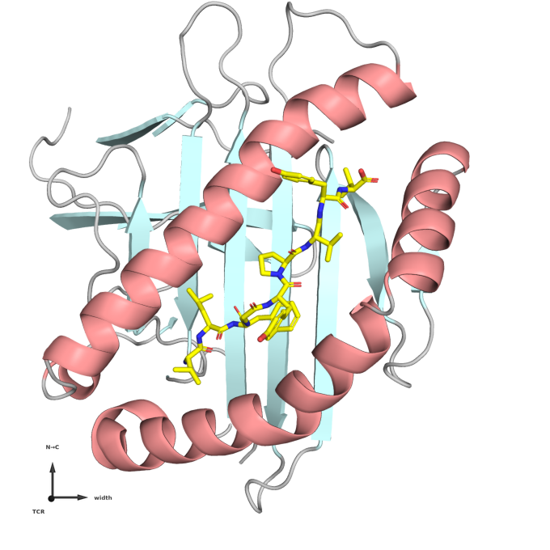
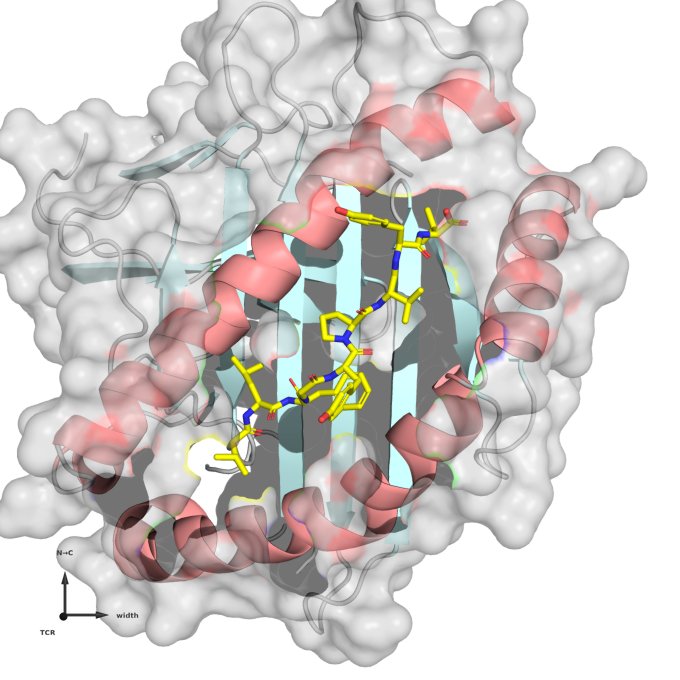
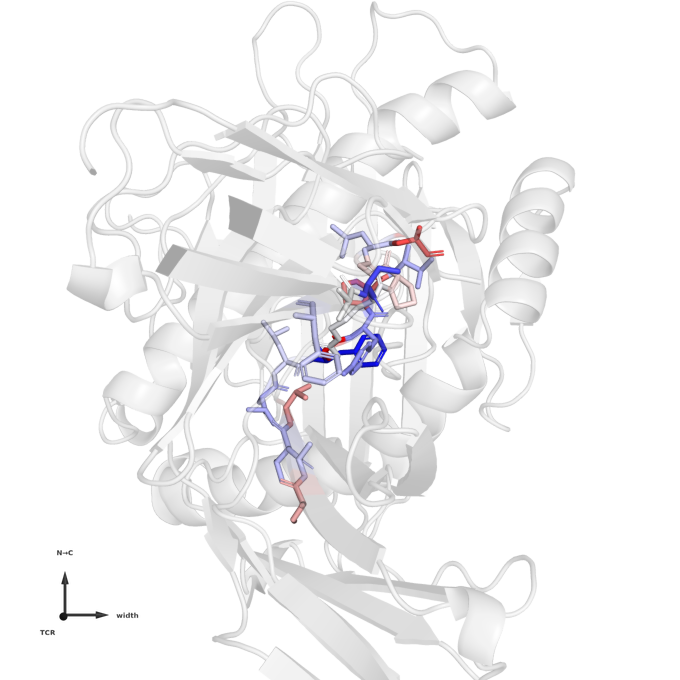
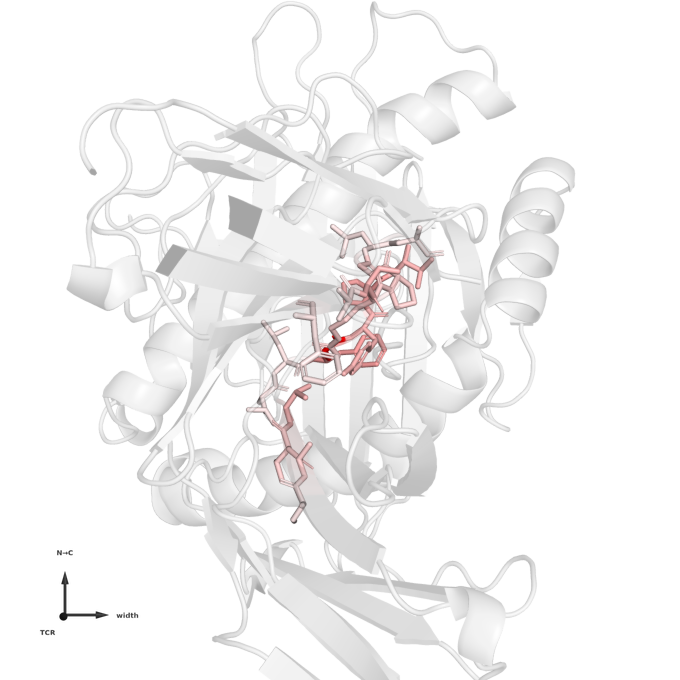
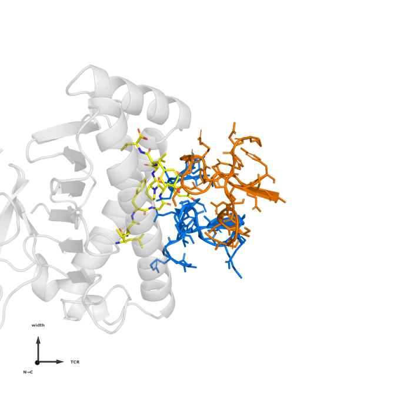
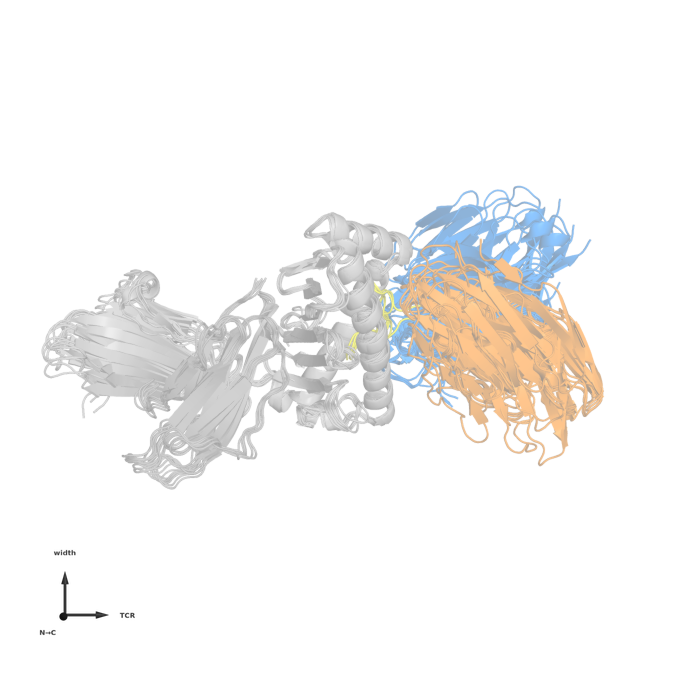

Figure gallery
==============

Every panel below is one call to :func:`tcren.viz.pymol.render` on a scene from the same module,
ray-traced by a headless PyMOL. They are library functions rather than notebook snippets, so a
figure in a paper, in a notebook and in a script are the same figure.

.. code-block:: bash

   pip install "tcren[viz]"     # matplotlib + py3Dmol; PyMOL itself is a separate install
   tcren fetch-data             # populates data/Canonical2026

Reading the axis gizmo
----------------------

Every panel carries a thin, arrow-headed triad in its bottom-left corner. A canonically-oriented
structure is not interpretable unless the reader can tell which way the frame points, and ``x/y/z``
does not tell them, so the arrows are named for what they mean:

.. list-table::
   :header-rows: 1
   :widths: 8 14 78

   * - axis
     - label
     - direction
   * - ``x``
     - ``width``
     - groove width, across the cleft (α1↔α2)
   * - ``y``
     - ``N→C``
     - groove axis, signed toward the peptide C-terminus
   * - ``z``
     - ``TCR``
     - docking normal, MHC floor → TCR

The triad turns with the camera. An axis pointing at the viewer foreshortens to a dot, and its
label drops to the lower left of that dot — the usual convention for an axis normal to the page.
So in a top-down view ``TCR`` sits at the origin, and in a side-on view ``N→C`` does.

These are the three directions the docking-geometry literature uses; the principal-component
*ranking* differs from it because :mod:`tcren.orient.frame` fits the whole complex where the
groove-only conventions fit the MHC alone. :data:`tcren.viz.pymol.CANONICAL_AXES` carries the
names, the definitions and the correspondence.

The peptide in the groove
-------------------------

Looking down the docking normal, from where the TCR sits: the peptide as sticks in the cleft, the
MHC coloured by domain — helices salmon, β-sheet floor cyan.

.. code-block:: python

   from tcren.viz.pymol import render, groove_scene
   render(groove_scene("1ao7", "data/Canonical2026"), "groove.png")

With ``surface=True`` the MHC gains a translucent molecular surface, which is how `histo.fyi
<https://www.histo.fyi/>`_ presents a structure — the cleft reads as a cleft rather than as ribbon.

.. code-block:: python

   render(groove_scene("1ao7", "data/Canonical2026", surface=True), "surface.png")

Which residues carry the score
------------------------------

The interface energy Φ is a sum over residue–residue contacts, so it decomposes exactly: each
residue's share is the sum of ``φ(a_i, a_j)`` over the contacts it makes across the interface. That
is the quantity worth colouring by — the total says how large the score is, the decomposition says
what it is *made of*.

:func:`tcren.viz.pymol.residue_importance` computes it and
:func:`tcren.viz.pymol.importance_scene` paints it: CDR3 and peptide residues as sticks on a ramp,
everything else pale.

.. code-block:: python

   from tcren.viz.pymol import render, residue_importance, importance_scene

   imp = residue_importance(structure)          # per-residue phi and contact count
   render(importance_scene("1ao7", "data/Canonical2026", imp), "importance.png")

**Blue is favourable, red unfavourable.** The ramp is centred on zero rather than fitted to the
observed range, so the colours keep that meaning: a range-fitted ramp would paint the
least-favourable residue red even in an interface where every contact is stabilising.

The same call colours by the *geometric* share instead — how much of the interface a residue
physically occupies, rather than how much energy it contributes. A residue can be large on one and
small on the other, and that difference is usually the interesting part.

.. code-block:: python

   render(importance_scene("1ao7", "data/Canonical2026", imp,
                           by="n_contacts", spectrum="white_red"), "contacts.png")

.. note::

   Each contact is attributed to **both** residues it joins, so the per-residue values sum to
   twice Φ. It is an attribution, not a partition — the energy of a contact belongs to the pair,
   not to either partner.

The recognition interface
-------------------------

Peptide plus the CDR1–3 loops that reach it, over a pale MHC, seen side-on — the plane the
crossing and incident angles live in.

.. code-block:: python

   from tcren.viz.pymol import render, interface_scene
   render(interface_scene("1ao7", "data/Canonical2026", cdr_resi), "interface.png")

An ensemble in one frame
------------------------

Because orientation puts every structure in the same frame, an overlay is meaningful: the MHC
superposes and the spread you see is real variation in how the receptors dock.

.. code-block:: python

   from tcren.viz.pymol import render, overlay_scene
   render(overlay_scene(pdb_ids, "data/Canonical2026"), "overlay.png")

Exploring interactively
-----------------------

Two notebooks in ``notebooks/`` drive all of the above:

``pymol_canonical_figures.ipynb``
   The static gallery — every view family over the four MHC class × species groups.

``pymol_interactive.py``
   A `marimo <https://marimo.io>`_ app: pick a structure and a scene, swing the camera and watch
   the gizmo follow, restyle it, and rotate a live 3Dmol.js view with the mouse.

   .. code-block:: bash

      pip install marimo
      marimo run notebooks/pymol_interactive.py     # or `marimo edit` to change the code

``surface_topology.py``
   pMHC surface topography — elevation, charge and hydropathy over the groove, with the
   featureless-vs-bulged epitope comparison drawn on one colour scale. Rendered with its figures
   at :doc:`notebooks/surface_topology`; run it live to change the channel, grid and structure.

   .. code-block:: bash

      marimo run notebooks/surface_topology.py

For a viewer inside a Jupyter notebook without leaving Python,
:func:`tcren.viz.view_pocket_cdr` returns a ``py3Dmol`` view of the same oriented groove.
